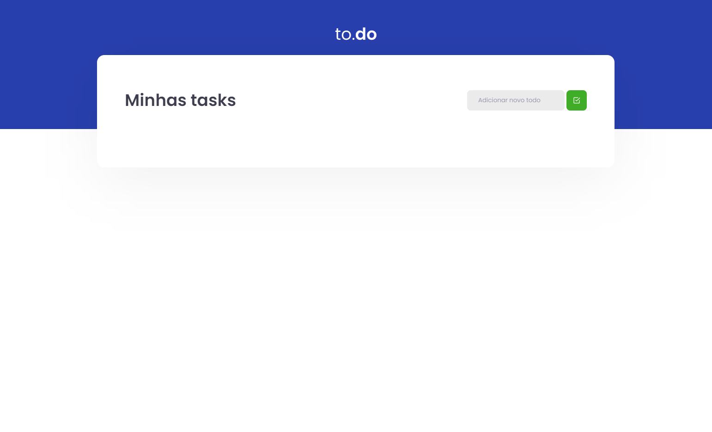

# Projeto de lista de tarefas

### Feito de acordo com o projeto proposto, do desafio do IGNITE trilha React

## Objetivo do projeto:

## Criar uma lista de tarefas para o usuário, com as seguintes funcionalidades:

### - Adicionar tarefas

### - Remover tarefas

### - Marcar tarefas como concluídas

## Como funciona:

### - O usuário pode adicionar tarefas

### - O usuário pode remover tarefas

### - O usuário pode marcar tarefas como concluídas

### Vocês devem baixar as dependências do projeto:

## - npm install ou yarn install

